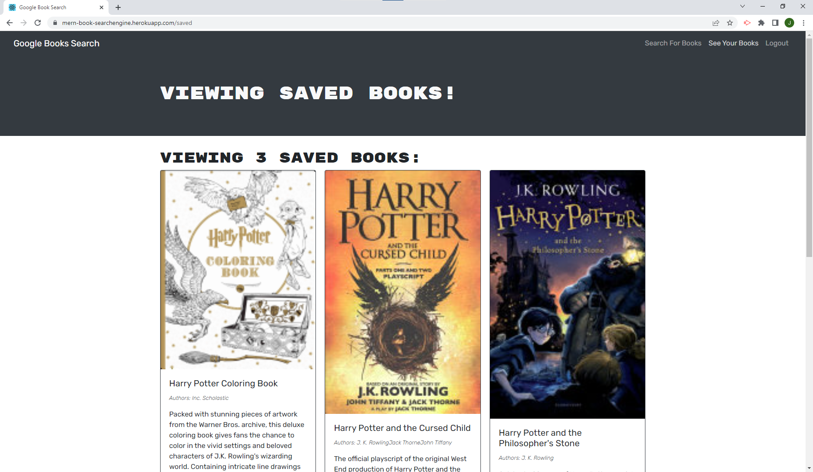

# MERN Book Search Engine 

## Description

### What does MERN Book Search Engine do?

This is a react app that was refactored from using api routes to using graphQL, useQuery, and useMutation.


## Table of Contents

- [Installation](#installation)
- [Usage](#usage)
- [Credits](#credits)
- [Contribution](#contribution)
- [Questions](#questions)
- [Licence](#licence)

---

## Installation 

### Technologies Used in Development

Technologies used include:

This project uses graphQL and apollo-server-experss, MongoDb, React, JWT, and bcryptjs among other technologies.

### Installation Instructions

```md
Visit deployment on heroku!
```

## Usage



```md
Create an account, and search for books. You have the option to save books to your profile to view at a later date.
```

## Credits

Refactored an app provided by the bootcamp. Most previous code is commented out

## Contribution

Guidelines for contribution:

no contribution necessary

## Questions

no contact

https://github.com/jq67


---
## Licence
This project is covered under the `Mit License`